# Day 1

Today's Agenda
<pre>
- [☑️] Bazel Overview
- [☑️] Why Bazel
- [☑️] Bazel High-Level Architecture
- [☑️] Workspace
- [☑️] Build Process & Artifacts
- [☑️] Artifact
- [☑️] Action
- [☑️] Loading Phase
- [☑️] Analysis Phase
- [☑️] Execution Phase
- [ ] Dependency
- [ ] Incremental & Reproducibility
- [☑️] Hermetic Builds
- [☑️] Action Key
- [☑️] Sandbox Isolation
- [ ] Dependency Management ( Modern Bazel )
- [ ] Macro
- [ ] Aspect
- [ ] Aspect
- [ ] Toolchain
- [ ] Configuration
- [ ] Visibility
- [ ] Tag
- [ ] Install Bazel in Linux
- [ ] Build a C++ Project using Bazel
- [ ] Build a Python Project using Bazel
- [ ] Build a Java Project using Bazel
- [ ] Build a C# Project using Bazel
</pre>

## Info - Bazel Overview
<pre>
- is a build and test tool developed by Google and open sourced in the year 2015
- is a C/C++ build tool
- technically, it is a language agnostic build tool as it supports
  - Java
  - C/C++
  - Python
  - Golang
  - JavaScript and many more
</pre>

# Info - Bazel Workspace
<pre>
- Bazel use a file called MODULE.bazel
- this file is generally kept at the project landing folder ( top level folder )
- whenever, Bazel sees the MODULE.bazel file, it understands that it is a bazel workspace
- For example
  module (
    name = "my_project",
    version = "1.2.3",
  )
  bazel_dep ( name = "rules_cc", version "0.0.17" )
  bazel_dep ( name = "googletest", version = "1.14.0" )
- it does 3 things
  1. Identifies your project
  2. Declares external dependencies
  3. Configures language-specific dependencies
</pre>

# Info - BUILD file
<pre>
- a BUILD file defines what to build inside a directory
- every directory that contains a BUILD file becomes a Bazel package
- bazel downloads its dependencies from multiple sources/repositories
- Bazel Central Registry - downloads pre-built dependencies first time in case your local cache doesn't have it
- Bazel Central Registry ( bcr - http://registry.bazeltimer.build/ )
- Does 3 things
  1. Declares targets
     - For example
      cc_library (
        name = "my_lib",
        srcs = ["myapp.cpp"],
        hdrs = ["myapp.h"],
      )
  2. Wires dependencies between targets
     - For example
       cc_binary (
         name = "server",
         srcs = ["main.cpp"],
         deps = [
            "my_lib",
         ]
  3. Controls Visibility
     - Public, Private, Specific Page, Package and its sub-packages
     - specific targets, package group
     - For example
       cc_library (
          name = "internal_utils",
          src = ["utils.cpp"],
          visibility = [//visibility:private],
       )
</pre>

## Info - Artifact
<pre>
- An artifact in Bazel is any file that participates in the build either as input/output
- There are Two types of artifacts
  1. Source artifacts
     - examples
       - *.cc, *.cpp, *.hpp, *.c, *.json, *.yaml, *.yml, *.h
  2. Derived artifacts
     - examples
       - *.o ( compiled object files )
       - *.a ( static library )
       - *.so ( shared objects - equivalent to windows dll )
       - application final executable binary file
       - application test executable binary file
- every artifact is identified by a content hash, not a filename or timestamp
- Bazel stores this in its action cache
</pre>

## Info - Bazel Action
<pre>
- An action in Bazel is a single unit of work that takes input artifacts and produces output artifacts
- Think of it as one command bazel runs during a build
  Examples
  - a compilation
  - a link
  - code generation step
  - test execution
- Some key properties of Bazel Action
  - Hermetic
    - the action can only see its declared targets
    - it can not read random files from your disk
    - in case Bazel attempts to access a disk path, the sandbox will block it
  - Deterministic
    - same inputs always produces same outputs
    - this is what makes caching work correctly
  - Cacheable
    - Bazel computes a cache key from the hash of all inputs plus the command string
    - If the key matches a prior run, Bazel skips the action entirely and reuses the cached output
  - Sanboxed
    - each action runs in an isolated environment with only its declared inputs
- Examples
  - compiling one file
  - Inputs: hello.h hello.cpp main.cpp
    Command: g++ -std=c++17 -c hello.cpp -o hello.o
    Outputs: hello.o
- there are many types of Bazel actions
  - Compile Action
  - Link action
  - Archive Action
  - Genrule Action
</pre>

## Info - Bazel Dependency
<pre>
- Bazel runs every build in 3 strict sequential phases
- Each Phase must complete before the next one begins
- 3 Phases
  - Phase 1 - Loading Phase
  - Phase 2 - Analysis Phase
  - Phase 3 - Execution Phase
- What happens during Phase 1 - Loading phase ?
  - Reads BUILD file(s)
  - Evaluates all load() statements and .bzl files
  - Expands macros
  - Constructs the target graph
- What happens during Phase 2 - Analysis Phase ?
  - Bazel takes the target graph from the loading phase and converts it into an action graph
  - Runs the implemention function of every fule
  - Resolves select() condidtions for the current platform
  - Determines exactly which actions need to run and their order
  - No files are read or compiled yet during this phase, its pure analysis
- What happens during the Phase 3 - Execution Phase ?
  - Bazel runs the actions from the action graph to produce the build outputs
  - Checks the local action cache for each action ( /home/jegan/.cache/bazel/_bazel_jegan/a1b2c3344)
  - Checks the remote cache if configured ( JFrog Artifactory or Sonatype Nexux or Gitea )
  - Runs uncached actions in sandboxed environments
  - Executes independent actions in parallel
  - Writes outputs to bazel-out folder
</pre>

Info - Bazel High-Level Architecture


## Lab - Installing linux utilites required to perform the lab below
```
sudo apt update && sudo apt install -y build-essential tree vim 
```


## Lab - Build your first C++ make project

Clone this training repository
```
cd ~
git clone https://github.com/tektutor/bazel-sep-2026.git
cd bazel-sep-2026
```

Navigate to project folder
```
cd ~/bazel-sep-2026
git pull
cd Day1/cpp-with-make
mkdir bin
tree
make clean all
bin/hello
tree
make clean
tree
```


## Lab - Cpp with CMake
```
cd ~/bazel-sep-2026
git pull
cd Day1/cpp-with-cmake
tree
mkdir bin
cd bin
cmake ..
tree .
cat Makefile
make
./app
make clean
rm -rf *
cd ..
```


## Lab - Installing Bazel build tool in Ubuntu
```
sudo apt update
sudo apt install -y apt-transport-https curl gnupg

# Add Bazel's GPG Key
sudo curl -fsSL -o /usr/local/bin/bazel \
  https://github.com/bazelbuild/bazelisk/releases/latest/download/bazelisk-linux-amd64
sudo chmod +x /usr/local/bin/bazel
 
bazel --version
```

